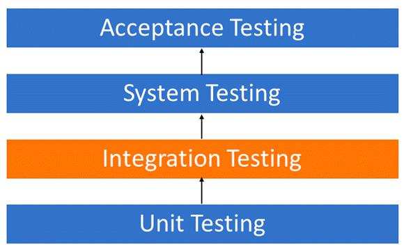
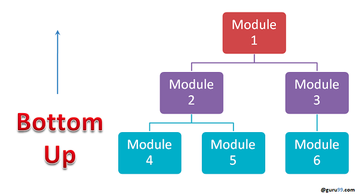
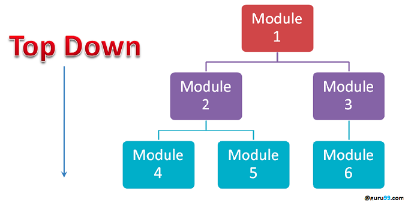
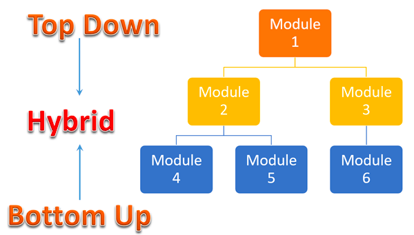
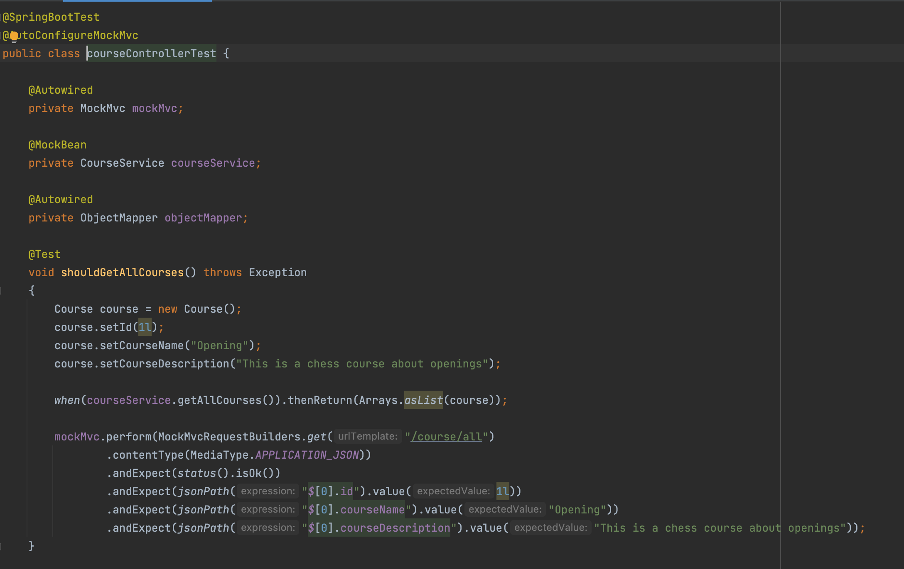

## What is integration testing and how can they apply to a microservice architecture?

Integration testing is a type of software testing that aims to verify the interaction and communication between
different components or systems in a software application. In the context of microservices, integration testing is
crucial to ensure that each microservice works correctly with other microservices in the system and that the overall
system functions as expected.

(Integration testing occurs after unit tests and before system tests.)

## Why use integration testing?
#### Library strategy of Dot-Framework

There are several reasons why defects may still occur even after testing individual modules. For example:

1. A module made by an individual developer may have different understanding or programming logic compared to others,
   leading to issues when integrating the module with the rest of the system.
2. The interface between a module and a database may be incorrect, causing issues during integration.
3. Poor exception handling may also lead to defects during integration. Therefore, integration testing becomes necessary
   to verify that the software modules work in unity and to identify and resolve any issues.

## What types of integration testing are there? 
#### Library strategy of Dot-Framework

There are several strategies for integration testing, each with its own advantages and limitations. Below is a list of
some of these strategies, along with how they are executed and their potential benefits and drawbacks:

### Big bang testing:

Big bang testing is a method of integration testing in which all components or modules are integrated and tested at
once. This approach requires that all components in the unit are completed before testing can begin.

#### Advantages:

1. Convenient when you have a small system.

#### Disadvantages:

1. Fault localization is more difficult because of the sheer amount of components tested
2. Links could be missed because of the sheer amount of components that need to be tested.
3. Since all modules are tested at once, high-risk modules are not isolated and tested on priority.

### Incremental testing:

In incremental testing, modules are integrated and tested in logical groups. The process begins by integrating and
testing two or more modules that are related to each other, then additional related modules are integrated and tested
incrementally until all logically related modules have been successfully integrated and tested. This allows for a more
targeted and efficient testing process.

Incremental testing is carried out by two different methods:

1. Bottom up
2. Top down

#### Stubs and Drivers:

Stubs and drivers are dummy programs used in integration testing to simulate data communication between modules. These
programs do not implement the full programming logic of the module, but rather act as a substitute for missing
components during testing. They allow for testing to proceed even if certain modules are not yet complete, making it
possible to test the system incrementally.

#### Stub:

Is called by the Module under Test.

#### Driver:

Calls the Module to be tested.

### Bottom-up testing:

In bottom-up integration testing, lower level modules are tested first and then used to facilitate testing of higher
level modules. This process continues until all top level modules have been tested. Once the lower level modules have
been tested and integrated, the next level of modules is formed and the process repeats until the entire system has been
tested. This approach allows for a more targeted and incremental testing process, but can be time-consuming if the
system has many levels of modules.

Example:

Advantages:

1. Fault localization is easier.
2. No time is wasted waiting for all modules to be developed unlike Big-bang approach

Disadvantages:

1. Critical modules (at the top level of software architecture) which control the flow of application are tested last
   and may be prone to defects.
2. An early prototype is not possible

### Top-down integration testing:

Top-down integration testing is a strategy which the higher modules are tested first and then lower level modules are
tested and integrated in order to check the software functionality. Stubs are used for testing if some modules are not
ready.

Example:

Advantages:

1. Fault localization is easier.
2. Possibility to obtain an early prototype.
3. Critical Modules are tested on priority; major design flaws could be found and fixed first.

Disadvantages:

1. Needs many stubs.
2. Modules at a lower level are tested inadequately.

### Sandwich Testing

Sandwich testing is a hybrid integration testing strategy that combines top-down and bottom-up approaches. In this
method, top level modules are tested with lower level modules at the same time that lower modules are integrated with
top modules and tested as a system. This approach makes use of both stubs and drivers to facilitate testing. Because it
combines elements of both top-down and bottom-up approaches, it is sometimes referred to as hybrid integration testing.
This method allows for a more efficient and targeted testing process, but may require more resources and effort to
implement.

## Why run integration testing on microservices? 
#### Field strategy of Dot-Framework

One of the key benefits of microservices is the ability to independently deploy and scale each service, which makes
integration testing an essential part of the development process. By thoroughly testing the integration between
microservices, developers can identify and resolve any issues before deploying the services to production.

## How to approach integration testing in the context of microservices? 
#### Library strategy of Dot-Framework
There are several approaches to integration testing microservices, including:

1. Contract testing: This involves defining a set of expectations or "contracts" between microservices and verifying
   that these contracts are met. For example, a contract could specify the format of request and response payloads
   between two microservices.
2. API testing: This involves testing the API (Application Programming Interface) of each microservice to ensure that it
   can receive and respond to requests correctly.
3. End-to-end testing: This involves testing the entire system from start to finish, including all microservices and
   their interactions. This can be done using tools like Selenium or Cypress.
4. Load testing: This involves testing the system's performance and stability under high loads or traffic. This can be
   done using tools like JMeter or Gatling.

In addition to these approaches, it is important to consider the following best practices when integrating
microservices:

1. Use automated testing tools: Automated testing tools can save time and reduce the risk of human error, and are
   especially useful for testing microservices at scale.

2. Test early and often: It is important to start testing as early as possible in the development process and to test
   frequently as changes are made to the system. This will help identify issues early on and reduce the risk of problems
   being introduced in later stages.

3. Use mock data: Using mock data can help isolate the system under test and reduce the risk of external dependencies
   affecting the results of the test.

4. Monitor and log test results: It is important to monitor and log the results of integration tests to identify any
   issues and track progress.

## How can I apply integration testing on my own project?
#### Lab strategy of Dot-Framework

My project uses a microservice design. To ensure that these services do what they are intended to do I will use integration
testing on them. The approach of testing that I'm going to use is API Testing, this mean I will test the services on receiving and responding correctly to requests.
In addition to these approaches I will consider using the best practices as mentioned in the sub-question "How to approach integration testing in the context of microservices?".

Example of integration testing in the Chessworkz service.

## Conclusion

In conclusion, integration testing is a crucial part of developing and maintaining a microservices system. By using
automated testing tools, testing early and often, using mock data, and monitoring and logging test results, developers
can ensure that their microservices are working correctly and that the overall system is stable and reliable.

#### Sources:

https://www.guru99.com/integration-testing.html (Integration Testing: What is, Types with Example)

https://www.runforesight.com/blog/microservices-testing-a-quick-start-guide (Microservices Testing: A Quick Start Guide)

https://semaphoreci.com/blog/test-microservices (Testing Strategies For Microservices)