# Portfolio

## 1. Web Application
**Learning outcome:**

You design and build **user-friendly, full-stack** web applications.

**Clarification**

**User-friendly:** You apply best practices when creating user interfaces and basic user experience testing and development techniques.

**Full-stack:** You design and build a full stack application using a commonly accepted front end Javascript framework and back end application implementing relevant communication protocols, persistence of data by usage of ORM and addressing asynchronous communication issues.

For my project I have designed and build a full stack application with the following technologies: 
1. React
2. Java Spring-Boot
3. Micro-Services

For more explanation please go to this **wiki-page:**
https://github.com/Davidchang24/Chessworkz/wiki/Architectual-and-Technical-Choices

## 2. Software Quality 
**Learning outcome:**

You use software tooling and methodology that continuously monitors and improve the software quality during software development.

**Clarification:**

Tooling and methodology: Carry out, monitor and report on unit integration, regression and system tests, with attention for security and performance aspects, as well as applying static code analysis and code reviews.
For my project I have automated the tests with the help of Github actions. I've also implemented static code analysis with Sonarcloud.

**Automated tests:**

Example of an integration test in one of my services
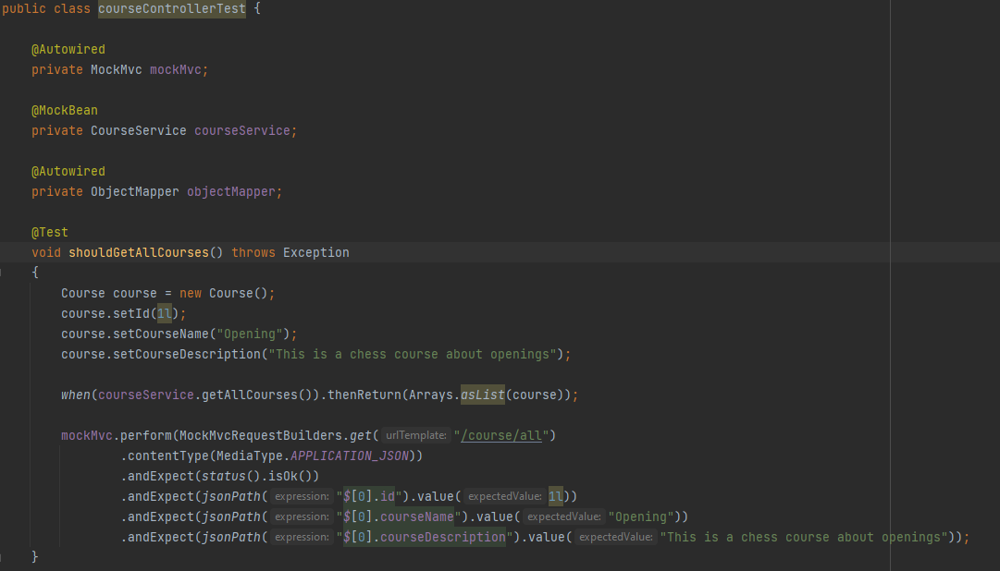
**Static code analysis:**

## 3. Agile Method
**Learning outcome**

You choose and implement the most suitable agile software development method for your software project.

**Clarification:**

**Choose:** You are aware of the most popular agile methods and their underlying agile principles. Your choice of a method is motivated and based on well-defined selection criteria and context analyses.

During the group project we've been working in an agile way. As a group we've chosen to use Scrum. This is what we're most familiar with and the PO's also seemed to have experience with.
We worked in sprints of 3 weeks, during these sprints we work on user-stories that we've prioritised with the PO's. 
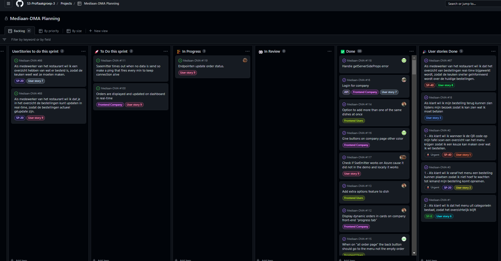

_These **user-stories** are given **story points** (grade for difficulty judged by all group members). We use these story points to track our work speed (how many points can we clear in a sprint?)._

The idea is that we work on these user-stories in each sprint, test (acceptance criteria) and deploy it and then review it with our PO's.
It's a continues cycle that keeps repeating until we finish all the user-stories. After each sprint we try to refine  our user-stories and do retrospectives with the team. This way we try to improve each time we start a new sprint.

The method we used during the retrospectives is that each of our team members try to notate 3 things we did great at and also 3 points where we could improve on. We try to make action points and focus on these the next sprint. 

Example: 

Reflection: 

I felt that as a group we were proficient in the technical part of the project, this includes coding, designing, etc.
But organising wasn't our strongest attribute. This caused some slight inconveniences when we tried to reflect on a sprint. 

Some felt that the productivity was differing quite a lot in the group. 
This I think, was mainly because of the lesser attention to detail that was put into Scrum method such as the stand-ups, refinement and the creation of tickets.
The great results we had during our spring deliveries overshadowed this problem for quite some time. 

Only until we truly became critical in our way of working (after sprint 3 retrospective) that we achieved a new level of productivity.
This showed me how important it is to have well-prepared and useful stand-ups/ planning-board and of course applying the feedback during retrospectives. I noticed that we weren't as often asking the questions
'What can I do now?', 'What are you doing right now?' and 'How far along are you with the part that you were busy with?'.

I've learned a lot during this project about why Agile working is and why it's used. I've experienced managing it as a scrum master myself and felt the improvement that it can provide when used the correct way in practice.

## 4. CI/CD
**Learning outcome:**

You design and implement a (semi)automated software release process that matches the needs of the project context.

**Clarification:**

**Design and implement:** You design a release process and implement a continuous integration and deployment solution (using e.g. Gitlab CI and Docker).

For my project I have implemented a CI/CD pipeline with GitHub CI, Docker and Heroku.

I have 2 main branches that I work in. Dev branch, that holds the latest version that I worked on and Main branch, the latest stable version that should be live. 

The workflow that I had in mind goes like this: 
1. In my repository there is a project. In this project I have planned out the backlog with requirements.
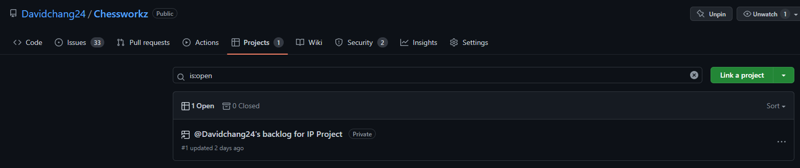
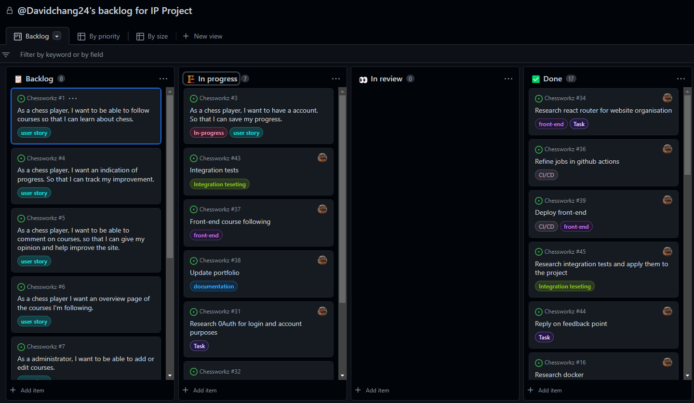

Each userstory has acceptance criteria that is explained in detail.
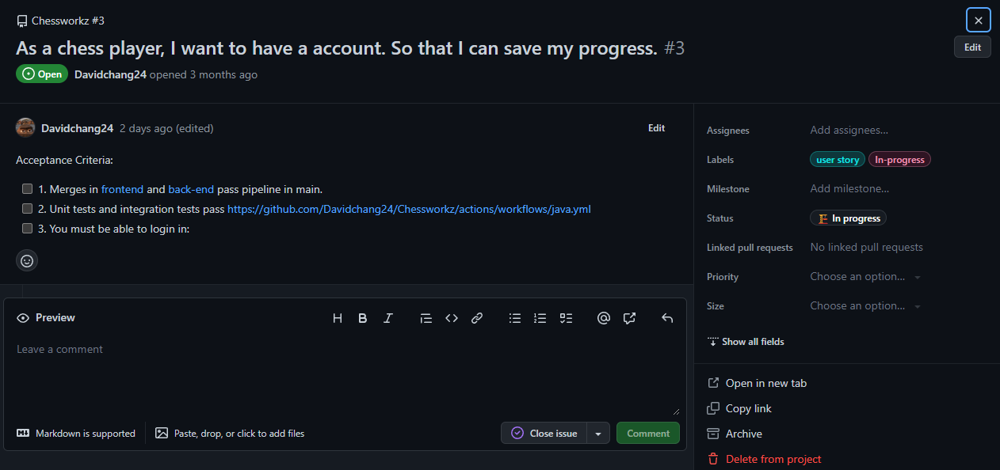

Workflow of CI/CD
1. **Push to dev branch**.

2. Java-pipeline with maven (runs tests and builds the project). 

3. Code quality scan (static code analysis)

4. Send **Merge request** to main branch if it passed the first 2 steps. 
5. Build and push docker image.

6. Deploy to Heroku so it becomes the live version. 

## 5. Cultural differences and ethics
**Learning outcome:**

You recognise and take into account cultural differences between project stakeholders and ethical aspects in software development.

**Clarifications:**

**Recognise:** Recognition is based on theoretically substantiated awareness of cultural differences and ethical aspects in software engineering.

**Take into account:** Adapt your communication, working, and behaviour styles to reflect project stakeholders from different cultures;

Address one of the standard Programming Ethical Guidelines (e.g., ACM Code of Ethics and Professional Conduct) in your work.

## 6. Requirements and design
**Learning outcome:**

You analyse (non-functional) requirements, elaborate (architectural) designs and validate them using multiple types of test techniques.

**Clarification:**

**Multiple types of test techniques:** You apply user acceptance testing and stakeholder feedback to validate the quality of the requirements. You evaluate the quality of the design (e.g., by testing or prototyping) taking into account the formulated quality properties like security and performance.

At the start of the semester we got a list of milestones for the project that was available from our PO's. 
The project can be described as a web application that helps restaurants automate and manage ordering food.

Out of those milestones we made a list of requirements, since we're working in an agile way. 

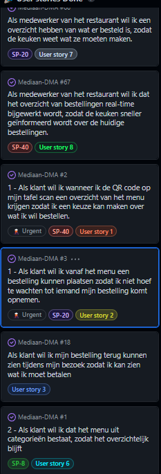

As you can see, all the user-stories have been given story-point. 
In the first sprint we were using T-Shirt sizes to categorize our priorities of user-stories.
We got feedback from the PO's and teacher that it would become too restricting. 

For example: What happens when more user-stories become larger and the biggest size you have is XL? Do you keep downscaling the others? Or are you going to use XXL, XXXL?

Our answer wasn't that clear. We came to the conclusion that the use of story-points was necessary. 

They've also been assigned with Acceptance criteria:
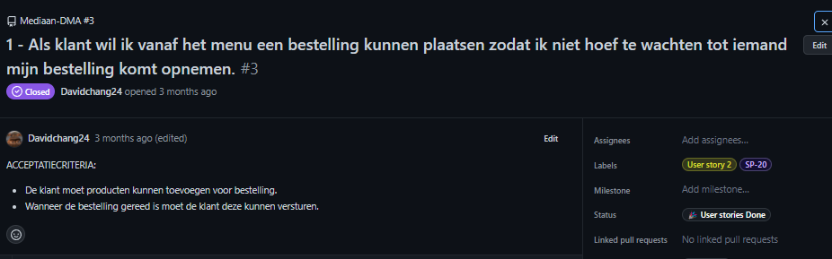

Acceptance criteria help us define what should be done for a user-story in specific, but also controls the quality that is delivered.

But the most important quality control happens at the sprint delivery with our PO's. 
In each delivery we show what we've accomplished until then and what was promised. 
Technical decisions that have been made are explained in detail to the PO's, so that they can have their input and approval of our choices.

Example of how a delivery would look in the form of a presentation: 

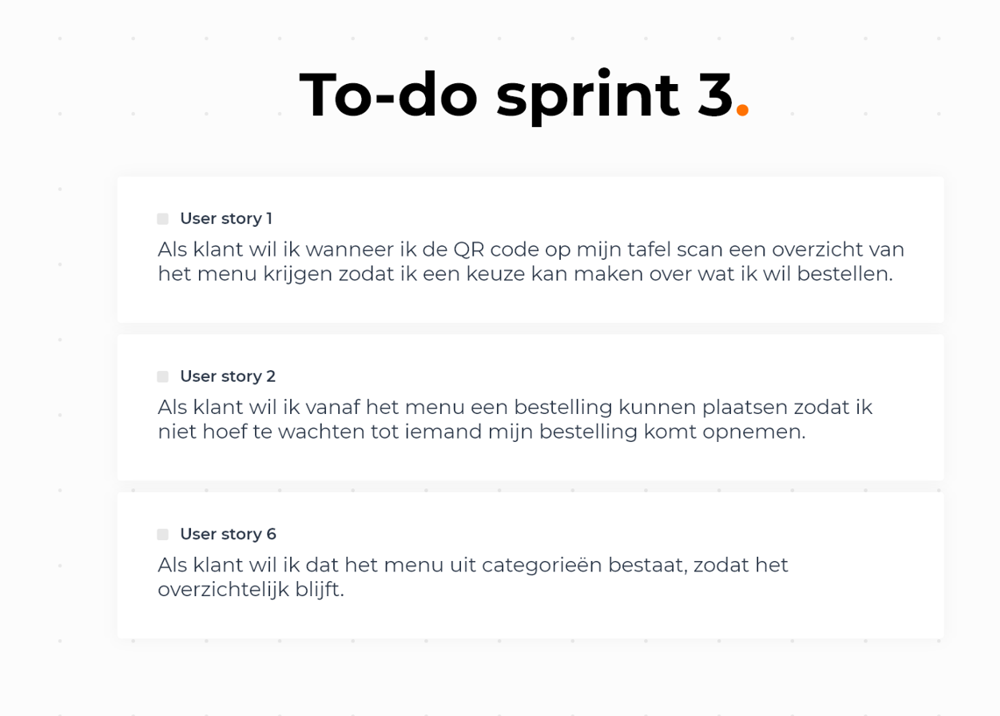

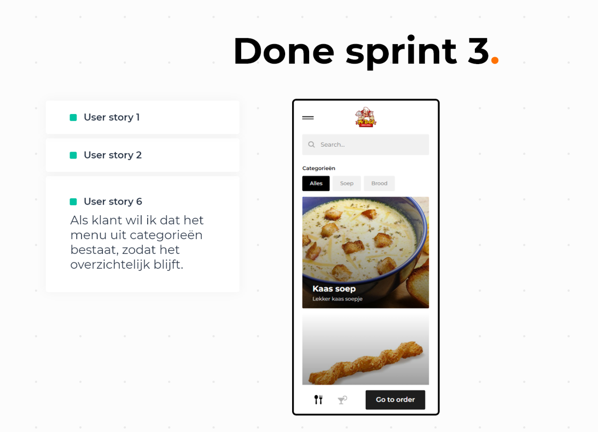

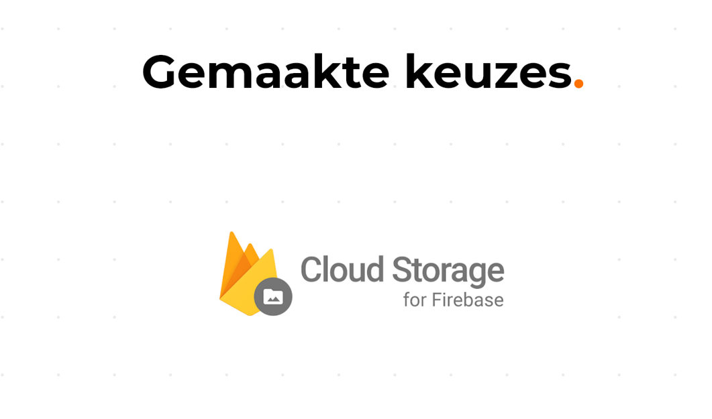

Example of feedback that has been notated:

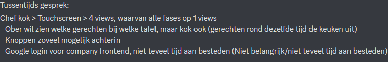

Reflection:
I felt that as a group we performed quite well on the topic of requirements and design. The PO's delivered the 'milestones' that they had in mind quickly and clearly. 
This made our job quite a bit easier. We got the initial list of requirements down in the first week and validated them with the PO's during our delivery. They gave us some tips such as 
acceptance criteria and splitting up bigger user-stories into smaller ones.

Also, at every sprint delivery we explain our choices made, for example the use of certain technologies, design of the website, etc. to the PO's and asked for their opinion.
Their feedback was mostly positive as I've experienced it, this shows again that our group was quite strong in the technical part of the project. They mostly had minor tips about the design of the website. 

Before the project I had worked with scrum on multiple occasions, I already had some idea's about requirements and design. 
What I've learned during this project are the fine details needed to write requirements well, such as story-points, Acceptance criteria and refinement.

## 7. Business processes
   **Learning outcome:**

You analyse and describe simple business processes that are related to your project.

**Clarification:**

**Simple:** Involving stakeholders, predominantly sequential processes with one or two alternative paths.

**Related:** Business processes during which the software that you are developing will be used (business processes that the software must support by fully or partially automating them).

or

Business processes needed for the success of your software development project (e.g., product release, market release, financial assurance).

## 8. Professional
   **Learning outcome:**

You act in a professional manner during software development and learning.

**Clarification:**

**Professional manner:**

You develop software as a team effort according to a prescribed software methodology and following team agreements. You are able to track your work progress and communicate your progress with the team.

You actively ask and apply feedback from stakeholders and advise them on the most optimal technical and design (architectural) solutions.
You choose and substantiate solutions for a given problem.